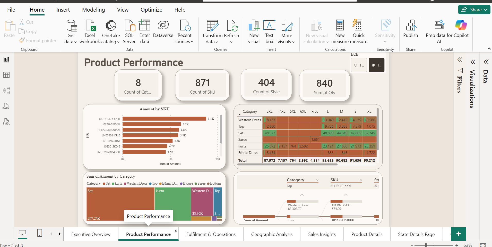
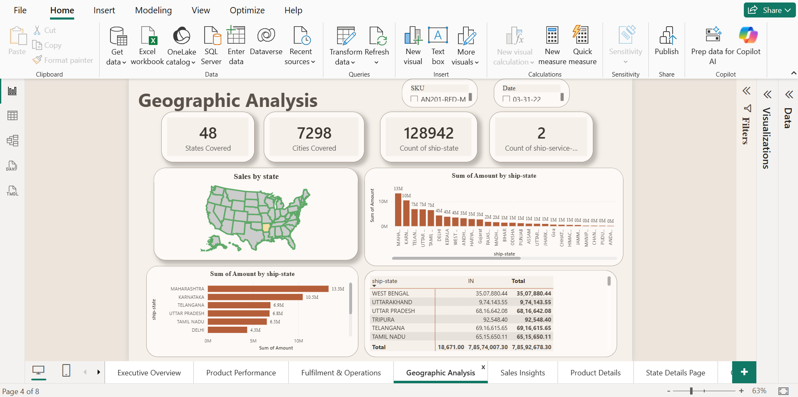
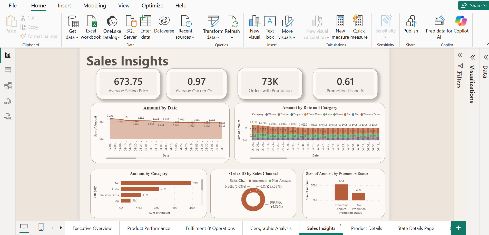
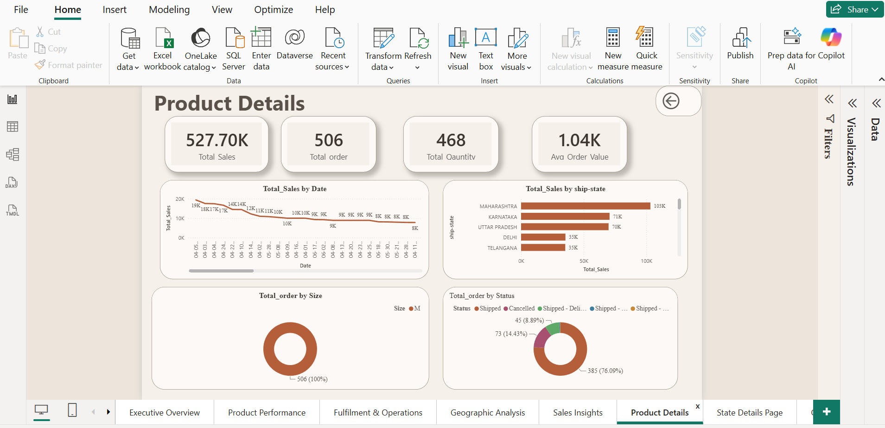
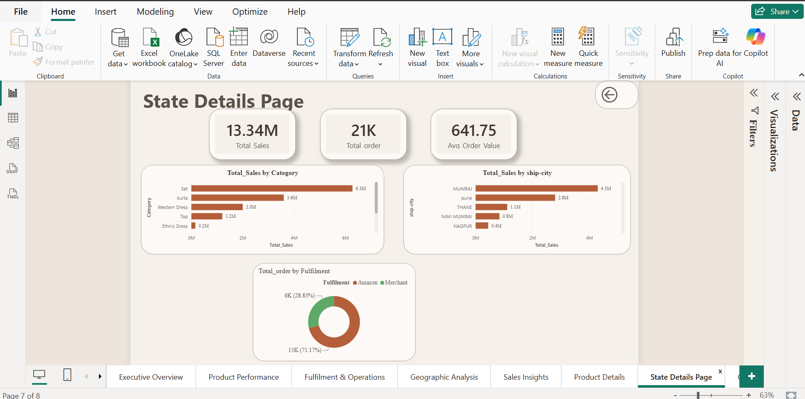

# 📊 Amazon Sales Analysis Dashboard

> An end-to-end Business Intelligence project built using **Python** and **Power BI** to transform raw Amazon sales data into actionable business insights.

---

## 📌 Project Overview

This project demonstrates a complete data analytics workflow—from raw data preprocessing in Python to interactive dashboard development in Power BI.

The objective is to analyze Amazon sales performance, identify business trends, evaluate fulfillment operations, and provide decision-makers with an interactive dashboard for data-driven insights.

---

## 🚀 Project Workflow

Raw Amazon Sales Data
⬇
Data Cleaning & Preprocessing (Python)
⬇
Data Validation
⬇
Power Query Transformation
⬇
DAX Measures & KPIs
⬇
Interactive Power BI Dashboard
⬇
Business Insights

---

## 🛠️ Tech Stack

| Tool | Purpose |
|------|----------|
| Python | Data Cleaning |
| Pandas | Data Manipulation |
| NumPy | Numerical Operations |
| Jupyter Notebook | Data Processing |
| Power BI Desktop | Dashboard Development |
| Power Query | Data Transformation |
| DAX | KPI & Measures |
| Excel | Data Source |

---

# 📂 Project Structure

```
Amazon-Sales-PowerBI-Dashboard
│
├── Data
│   ├── amazon_sales_raw.xlsx
│   └── amazon_sales_cleaned.xlsx
│
├── Python
│   ├── Data_Cleaning.ipynb
│   └── requirements.txt
│
├── PowerBI
│   └── Amazon_Sales_Dashboard.pbix
│
├── Images
│   ├── Executive_Overview.png
│   ├── Product_Performance.png
│   ├── Fulfilment_Operations.png
│   ├── Geographic_Analysis.png
│   ├── Sales_Insights.png
│   ├── Product_Details.png
│   ├── State_Details.png
│   └── Order_Details.png
│
└── README.md
```

---

# 📈 Dashboard Pages

## 1️⃣ Executive Overview

### KPIs

- Total Sales
- Total Orders
- Total Quantity
- Average Order Value
- Cancelled Orders

### Insights

- Sales Trend
- Order Status
- Sales by Category
- Fulfillment Analysis


---

## 2️⃣ Product Performance

### Analysis

- Product Category Performance
- SKU Performance
- Quantity by Size
- Product Distribution



---

## 3️⃣ Fulfillment & Operations

### Analysis

- Fulfillment Split
- Courier Status
- Order Status
- B2B Orders
- Shipping Service Level


---

## 4️⃣ Geographic Analysis

### Analysis

- Sales by State
- Geographic Distribution
- Top Performing States
- State-wise Revenue



---

## 5️⃣ Sales Insights

### KPIs

- Average Selling Price
- Average Quantity per Order
- Promotion Usage %
- Orders with Promotion

### Analysis

- Sales Trend
- Sales Channel
- Promotion Impact
- Category Performance



---

## 6️⃣ Product Drill-through

Provides detailed information for a selected SKU including

- Sales
- Orders
- Quantity
- Status
- State Performance



---

## 7️⃣ State Drill-through

Provides state-level business insights.

- Total Sales
- Orders
- Average Order Value
- Top Cities
- Category Performance



---

## 8️⃣ Order Details

Detailed transaction-level report including

- Order ID
- Date
- SKU
- Category
- Quantity
- Amount
- Status


---

# 📊 Key Business Insights

- Maharashtra generated the highest sales revenue.
- Amazon Fulfillment processed the majority of customer orders.
- The **Set** category contributed the highest revenue among all product categories.
- Promotional campaigns significantly improved total sales.
- Most customer orders were successfully shipped.
- Average Order Value remained stable across the analysis period.

---

# 📌 Features

✔ End-to-End Data Analytics Project

✔ Python Data Cleaning

✔ Interactive Power BI Dashboard

✔ Power Query Transformations

✔ DAX Measures

✔ Drill-through Analysis

✔ Business KPIs

✔ Dynamic Filters & Slicers

✔ Executive Dashboard

---

# 📚 Skills Demonstrated

- Data Cleaning
- Exploratory Data Analysis
- Business Intelligence
- Dashboard Design
- Data Visualization
- DAX
- Power Query
- Business Analytics
- KPI Development
- Interactive Reporting

---

# 👨‍💻 About Me

**Vikash Rao**

Aspiring Data Analyst passionate about transforming raw data into meaningful business insights using Python, SQL, Excel, and Power BI.

---

## 🌐 Connect With Me

- **GitHub:** https://github.com/vikashrao627-glitch
- **LinkedIn:** www.linkedin.com/in/vikash-rao-402044336
- **HackerRank:** https://www.hackerrank.com/profile/vikashrao627

---

## ⭐ If you found this project useful, consider giving it a Star!
